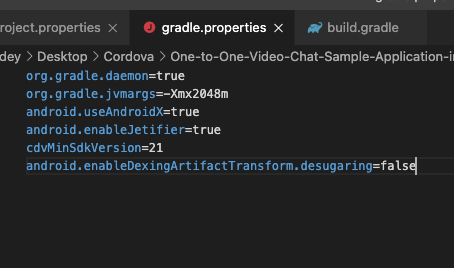
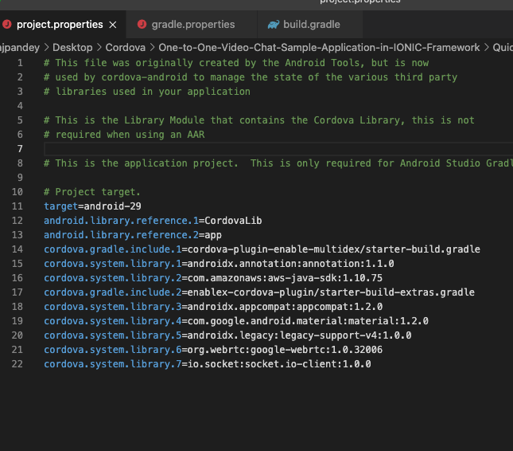
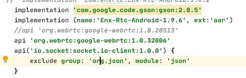

## 1. How to get started

### 1.1 Pre-Requisites

#### 1.1.1 App Id and App Key 

* Register with EnableX [https://www.enablex.io] 
* Create your Application
* Get your App ID and App Key delivered to your Email


#### 1.1.2 Sample Cordova Application 

* Clone or download this Repository [https://github.com/EnableX/One-to-One-Video-Chat-Sample-Cordova-Application.git] 


#### 1.1.3 Sample App Server 

* Clone or download this Repository [https://github.com/EnableX/Sample-Web-App-1to1-RTC.git] & follow the steps further 
* You need to use App ID and App Key to run this Service. 
* Your Cordova Sample Application Client End Point needs to connect to this Service to create Virtual Room.
* Follow README file of this Repository to setup the Service.

#### 1.1.4 Configure Cordova Sample Client 

* Open the Cordova sample App
* Go to index.js and change the following:
    ``` 
    var userName = "USERNAME"  /* HTTP Basic Auth Username of App Server */
    var password = "PASSWORD"  /* HTTP Basic Auth Password of App Server */
    var kBaseURL = "FQDN"      /* FQDN of of App Server URL */
    ```

 Note: The distributable comes with demo username and password for the Service.

#### 1.1.5 To install the EnableX Cordova plugin

* Run the following command in the root of your project:
    
    `cordova plugin add enablex-cordova-plugin@latest`

#### 1.1.6 How to setup cordova plugin Android/iOS

### Android
    
After adding Cordova Enablex plugin
### Step 1. 
    Go to platfrom inside Cordova project and open Android folder

    If Android platform already added, remove Android and add again using the below command: 
    ionic cordova platform rm android && ionic cordova platform add android`
    
### Step 2. 
    Set the Minimum SDK version and desugaring in gradle.properties file as shown:

 

    android.useAndroidX=true 
    android.enableJetifier=true 
    cdvMinSdkVersion=21 
    android.enableDexingArtifactTransform.desugaring=false 
    
### Step 3. 

    Add the required libraries like webrtc and socket in the project. properties file as shown below:
    
 
    
    cordova.system.library.7=org.webrtc:google-webrtc:1.0.32006 
    cordova.system.library.8=io.socket:socket.io-client:1.0.0 
    
### Step 4. 

    If you face “merge debug resource failed” error, then add packagingOptions in app level build.gradle file in android block 
    
    Execution failed for task ':app:mergeDebugJavaResource'. 
        > A failure occurred while executing com.android.build.gradle.internal.tasks.Workers$ActionFacade 
       > More than one file was found with OS independent path 'META-INF/DEPENDENCIES'.

 
       packagingOptions { 
               exclude 'META-INF/DEPENDENCIES' 
               exclude 'META-INF/LICENSE' 
               exclude 'META-INF/LICENSE.txt' 
               exclude 'META-INF/license.txt' 
               exclude 'META-INF/NOTICE' 
               exclude 'META-INF/NOTICE.txt' 
               exclude 'META-INF/notice.txt' 
               exclude 'META-INF/ASL2.0' 
               exclude("META-INF/*.kotlin_module")  
             } 

### iOS
    
        After adding Cordova Enablex plugin please add ios project as below command
        
        cordova platform add ios
        
        It will install all dependency enableX library through Pod. After that go to your iOS project folder and open your xcode , setup your certificate and then build the app either command line or through xcode. 
    
    
#### 1.1.7 To remove Enalex Cordova plugin

* Run the the following command in the root of your project:

    `cordova plugin remove enablex-cordova-plugin`
    


### 1.2 Walkthrough Cordova Sample Application 

#### 1.2.1 Pre-Requisites:

Make sure You have Cordova 3.5.0 or greater installed. If you haven't, take a look at the [Cordova instructions](http://cordova.apache.org/docs/en/3.5.0/guide_cli_index.md.html) Page.

1. Install [node.js](https://nodejs.org/)

2. Install Cordova: `npm install -g cordova`

3. Install and update [Xcode](https://developer.apple.com/xcode/) (you will need a Mac)

4. Install and update [Android Studio](https://developer.android.com/studio/index.html)

#### 1.2.2 Run The Application:

##### Note: Please make sure to run the commands in the same order as below

1. Clone this repo

2. In your terminal, change your directory to the root of the sample project you want to run.

3. Run the command:

        npm install
    to install required node modules

4. Run the command:

        cordova platform add ios    //to add iOS your project
        cordova platform add android // to add android project

5. Configuring the application
    Before running the application, you need to configure below as describe step 1.1.4.
    ``` 
    var userName = "USERNAME"  /* HTTP Basic Auth Username of App Server */
    var password = "PASSWORD"  /* HTTP Basic Auth Password of App Server */
    var kBaseURL = "FQDN"      /* FQDN of of App Server URL */
     ```    
6. Run the command to enable multidex.
    ```
    cordova plugin add cordova-plugin-enable-multidex 
    ```

6. Run the command
    ```
    cordova run ios  // to run iOS project
    cordova run android // to run Android project
    ```

## 2. Getting Started on your Project:

All your editing will be done in your www folder.


All JavaScript code should be written in `onDeviceReady` function in `/js/index.js` because it is executed after all dependencies has loaded.

In the onDeviceReady, Registered all event listener to receive callback in the running conference.
After callback registered, User needs to call joinRoom().
    
``` 
    var videoSize = {
          minWidth: 320,
          minHeight: 180,
          maxWidth: 1280,
          maxHeight: 720,
        };

        var streamOpt = {
          audio: true,
          video: true,
          data: true,
          audioOnlyMode: false,
          framerate: 30,
          maxVideoBW: 1500,
          minVideoBW: 150,
          videoSize: videoSize,
          audioMuted: false,
          videoMuted: false,
          maxVideoLayers: 1,
          name: "Shashank"
        };

        var playerConfiguration = {
          audiomute: true,
          videomute: true,
          bandwidth: true,
          screenshot: true,
          avatar: true,
          iconHeight: 30,
          iconWidth: 30,
          avatarHeight: 200,
          avatarWidth: 200,
        };


        var roomOpt = {
          allow_reconnect: true,
          number_of_attempts: 3,
          timeout_interval: 15,
          activeviews: "view",
          playerConfiguration: playerConfiguration,
          forceTurn: false,
          chat_only: false,
        };
     
    window.EnxRtc.joinRoom(result.token, streamOpt, roomOpt);
``` 
After joining room `onRoomConnected` listener is called. In this listener you have to initiate local view and remote view by following function.

```
    // To init local view
    var initLocalViewOptions = {
        height: 130,
        width: 100,
        margin_top: 50,
        margin_left: 0,
        margin_right: 15,
        margin_bottom: 00,
        position: "right"
      };
    window.EnxRtc.initLocalView(initLocalViewOptions, function (data) {
        console.log(JSON.stringify(data.data));
      }, function (err) {
        console.log('Uh oh... error' + JSON.stringify(err));
      });
      
    // To init Remote view
     var initRemoteViewOptions = {
        height: 1020,
        width: 480,
        margin_top: 50,
        margin_left: 0,
        margin_right: 15,
        margin_bottom: 00,
        position: "right"
      };

    window.EnxRtc.initRemoteView(initRemoteViewOptions, function (data) {
        console.log(JSON.stringify(data.data));
      }, function (err) {
        console.log('Uh oh... error' + JSON.stringify(err));
      });
```

For mute/UnMute Audio

```
    window.EnxRtc.muteSelfAudio(true/false);
    true - mute
    falsw - unmute
```
For mute/UnMute Video.

```
    window.EnxRtc.muteSelfVideo(true/false);
    true - mute
    falsw - unmute
```

Registered all Listener in onDeviceReady function
```
onDeviceReady: function() {
    // Do Your Stuff Here!
window.EnxRtc.addEventListner("onRoomConnected", function (data) {
            console.log(JSON.stringify(data.data));
            });
window.EnxRtc.addEventListner("onRoomError", function (data) {
            console.log(JSON.stringify(data.data));
        });
window.EnxRtc.addEventListner("onEventError", function (data) {
        console.log(JSON.stringify(data.data));
        });
window.EnxRtc.addEventListner("onAudioEvent", function (data) {
        console.log(JSON.stringify(data.data));
        });
window.EnxRtc.addEventListner("onVideoEvent", function (data) {
          console.log(JSON.stringify(data.data));
        });
window.EnxRtc.addEventListner("onRoomDisConnected", function (data) {
          console.log(+ JSON.stringify(data.data));
        });
window.EnxRtc.addEventListner("onNotifyDeviceUpdate",function (data) {
           console.log( JSON.stringify(data.data));
        });
window.EnxRtc.addEventListner("onScreenSharedStarted", function (data) {
          console.log(JSON.stringify(data.data));
        });
window.EnxRtc.addEventListner("onScreenSharedStopped", function (data) {
          console.log(JSON.stringify(data.data));
        });
window.EnxRtc.addEventListner("onCanvasStarted", function (data) {
          console.log(JSON.stringify(data.data));
        });
window.EnxRtc.addEventListner("onCanvasStopped", function (data) {
          console.log(JSON.stringify(data.data));
        });
window.EnxRtc.addEventListner("onUserConnected", function (data) {
          console.log(JSON.stringify(data.data));
        });
window.EnxRtc.addEventListner("onUserDisConnected", function (data) {
          console.log(JSON.stringify(data.data));
        });
    }
```
